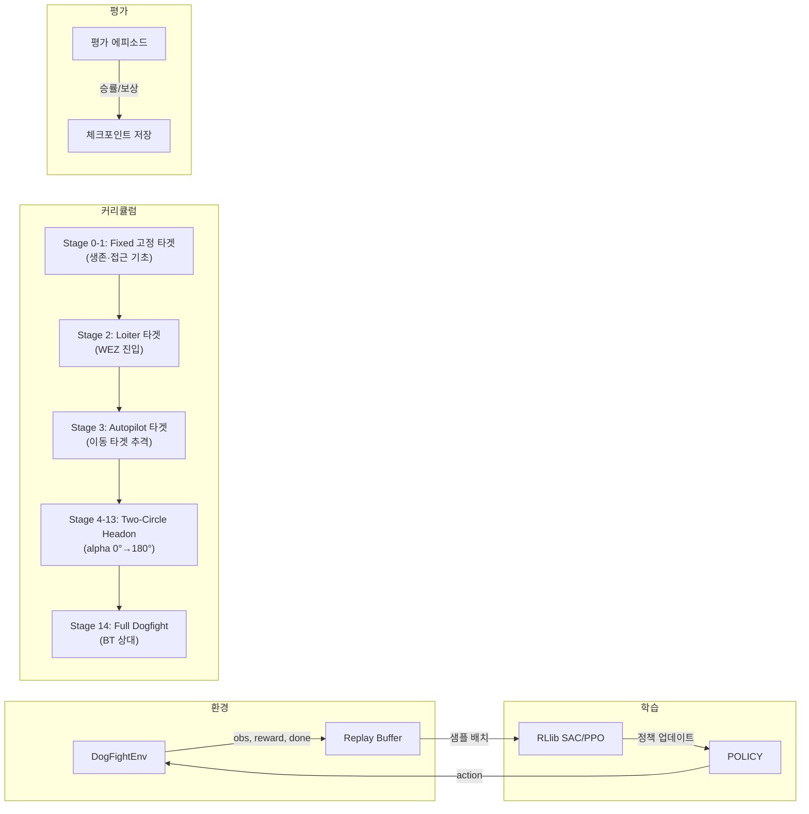

# 🔄 파이프라인 전체 흐름

[[00 - 전체 인덱스|← 인덱스로]]

---

## 에피소드 루프 전체 흐름

```mermaid
flowchart TD
    A([🚀 시뮬레이션 시작]) --> B[초기 시나리오 설정]
    B --> C{시나리오 모드}
    C -->|default| D[기본 포지션]
    C -->|two_circle_headon| E[헤드온 대형 배치]
    C -->|ref_old_random| F[랜덤 레거시 시나리오]
    D & E & F --> G[env.reset()]
    G --> H[JSBSim 물리 초기화]
    H --> I[초기 관측 생성]
    I --> J{에피소드 루프}

    J --> K[get_observation]
    K --> L{행동 제공자 선택}
    L -->|BT| M[C++ BehaviorTree.tick]
    L -->|RL| N[RLModule.forward_inference]
    L -->|Hybrid| O[BT + RL 조합]
    L -->|Fixed| P[step_fix 고정 제어]
    M & N & O & P --> Q[env.step action]

    Q --> R[_step_controlled_aircraft]
    R --> S[_step_target_aircraft]
    S --> T[update_damage / WEZ 판단]
    T --> U[evaluate_termination]

    U --> V{종료?}
    V -->|No| W[compute_reward]
    W --> X[관측 업데이트]
    X --> J

    V -->|terminated| Y[에피소드 결과 집계]
    V -->|truncated| Y
    Y --> Z{save_log?}
    Z -->|Yes| AA[make_tacviewLog CSV 저장]
    Z -->|No| AB([🏁 종료])
    AA --> AB
```

---

## 훈련 파이프라인 (RL 학습 루프)



---

## 단계별 핵심 흐름 요약

| 단계 | 컴포넌트 | 입력 | 출력 |
|------|----------|------|------|
| 1. 초기화 | `DogFightEnv.__init__` | env_config | Gym Env |
| 2. 리셋 | `env.reset()` | seed, options | obs(float32), info |
| 3. 관측 | `build_observation()` | ownship_state, target_state | obs[12/14/16] |
| 4. 행동 | `ActionProvider.compute_action()` | ActionContext | ActionResult(action[4]) |
| 5. 시뮬 스텝 | `JSBSim.step()` | action[4] | state[46] |
| 6. 데미지 | `update_damage()` | WEZ config | ownship/target_damage |
| 7. 보상 | `compute_reward()` | state, damage, config | (float, dict) |
| 8. 종료 | `evaluate_termination()` | state, time | (bool, bool, str) |

---

## 관련 노트

- [[02 - 환경 아키텍처]] — DogFightEnv 내부 구조
- [[04 - 관측 공간]] — 관측 생성 상세
- [[06 - 보상 함수]] — 보상 컴포넌트
- [[07 - 종료 조건]] — 종료 판단 로직
