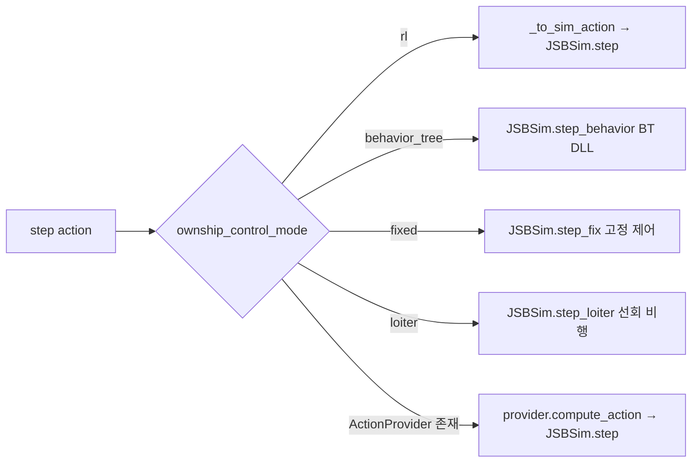

# 🕹️ 행동 공간

[[00 - 전체 인덱스|← 인덱스로]]

---

## 행동 벡터 구조

```python
action = [aileron, elevator, rudder, throttle]
# 모두 [-1, 1] 범위
```

| 인덱스 | 채널 | RL 범위 | 시뮬 범위 | 설명 |
|--------|------|---------|----------|------|
| 0 | Aileron (에일러론) | [-1, 1] | [-1, 1] | 롤 제어 (좌/우 기울기) |
| 1 | Elevator (엘리베이터) | [-1, 1] | [-1, 1] | 피치 제어 (기수 상/하) |
| 2 | Rudder (러더) | [-1, 1] | [-1, 1] | 요 제어 (방향타) |
| 3 | Throttle (스로틀) | [-1, 1] | [0, 1] | 엔진 출력 |

> **Throttle 변환**: `throttle_sim = (throttle_rl + 1) / 2`
> 미훈련 네트워크 출력 ≈ 0 → throttle_sim = 0.5 → 실속 방지

---

## 행동 공간 정의

```python
action_space = gym.spaces.Box(
    low  = np.full(4, -1.0, dtype=np.float32),
    high = np.full(4,  1.0, dtype=np.float32),
    shape= (4,),
    dtype= np.float32,
)
```

## 시뮬레이터 전달 변환

```python
def _to_sim_action(rl_action):
    a = np.clip(rl_action, -1.0, 1.0).astype(np.float32)
    a[3] = (a[3] + 1.0) / 2.0   # throttle: [-1,1] → [0,1]
    return np.clip(a, [-1,-1,-1,0], [1,1,1,1])
```

---

## 제어 모드별 행동 처리



---

## BFM (Basic Fighter Maneuver) 기동 모드

C++ BT에서 사용하는 기동 분류:

| 모드 | 설명 |
|------|------|
| `EF` (Engaged Fighter) | 교전 중 일반 기동 |
| `OBFM` (Offensive BFM) | 공격적 기본 전투 기동 |
| `DBFM` (Defensive BFM) | 방어적 기본 전투 기동 |
| `HABFM` (High Aspect BFM) | 고각도 교전 기동 |

---

## 훈련 팁

- **초반 탐색**: SAC의 엔트로피 조절로 넓은 행동 탐색
- **스로틀**: 에너지 관리의 핵심 — 너무 낮으면 실속, 너무 높으면 오버슈트
- **에일러론**: 빠른 롤로 WEZ 정렬이 관건
- **잔여 학습(Residual)**: Hybrid 모드에서 BT 기본 기동 위에 RL 잔차 추가

## 관련 노트

- [[09 - 행동 제공자]] — BT/RL/Hybrid 제공자
- [[10 - 비헤이비어 트리]] — C++ BT 기동 구현
- [[12 - 강화학습 훈련]] — 훈련 전략
