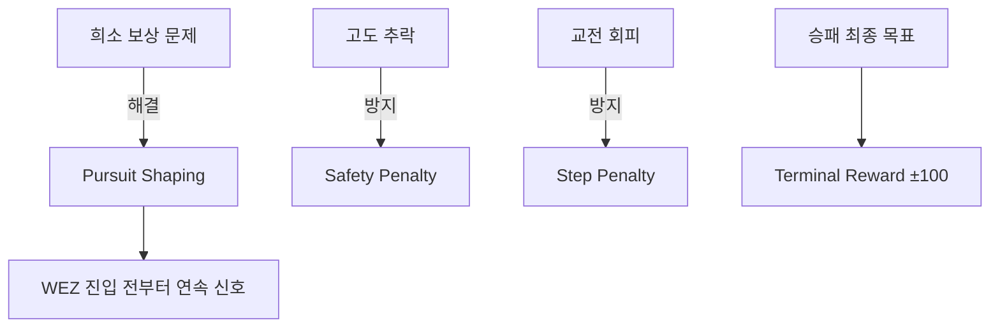

# 💰 보상 함수

[[00 - 전체 인덱스|← 인덱스로]]

---

## 보상 컴포넌트 (reward.py)

$$R_{total} = R_{survival} + R_{step} + R_{pursuit} + R_{damage} + R_{safety} + R_{terminal}$$

---

## 컴포넌트별 상세

### 1. 생존 보너스 (Survival)
```python
r_survival = reward_config.get("survival_bonus", 0.0)
# 커리큘럼 Stage0 전용 — 기본값 0
```

### 2. 스텝 패널티 (Step Penalty)
```python
r_step = reward_config["step_penalty"]  # 기본값: -0.01
# 매 스텝마다 감산 → 시간 효율성 유도
```

### 3. 추격 보상 (Pursuit Shaping)
```python
# 연속 그래디언트 — ATA × 거리
half_angle    = reward_config["pursuit_half_angle_deg"]  # 30.0 deg
pursuit_range = reward_config["pursuit_range_m"]          # 3000.0 m

ata_factor   = max(0, 1 - |ATA| / half_angle)   # ATA=0° → 1.0
range_factor = max(0, 1 - distance / pursuit_range)
r_pursuit    = pursuit_scale * ata_factor * range_factor
# pursuit_scale 기본값: 0.3
```

> WEZ 진입 전부터 학습 신호 제공 (희소 보상 문제 완화)

### 4. 데미지 차분 (Damage Differential)
```python
r_damage = damage_scale * (target_damage - ownship_damage)
# damage_scale 기본값: 20.0
# 목표: 적기에게 더 많은 피해를 주면 양의 보상
```

### 5. 안전 패널티 (Safety)
```python
if ownship_state[ALT] < 600.0:  # 600m 미만
    r_safety = -low_altitude_penalty  # 기본값: -0.1
# 저고도 추락 방지
```

### 6. 종료 보상 (Terminal)
```python
if terminated:
    if target_health <= 0 < ownship_health:    r_terminal = +100.0  # 승리
    elif ownship_health <= 0 < target_health:  r_terminal = -100.0  # 패배
    else:                                       r_terminal = -30.0   # 무승부
    if end_condition == "two circle headon guard fail":
                                                r_terminal = -50.0   # 가드 실패
```

---

## 기본 보상 설정값 요약

| 파라미터 | 기본값 | 설명 |
|----------|--------|------|
| `step_penalty` | -0.01 | 매 스텝 패널티 |
| `pursuit_scale` | 0.3 | 추격 보상 스케일 |
| `pursuit_half_angle_deg` | 30.0 | 추격 반각 (deg) |
| `pursuit_range_m` | 3000.0 | 추격 유효 거리 (m) |
| `damage_scale` | 20.0 | 데미지 보상 스케일 |
| `low_altitude_penalty` | 0.1 | 저고도 패널티 |
| `win_reward` | +100.0 | 승리 보너스 |
| `loss_reward` | -100.0 | 패배 패널티 |
| `draw_reward` | -30.0 | 무승부 패널티 |
| `guard_fail_penalty` | -50.0 | 두 원 가드 실패 |

---

## 커스텀 보상 함수 (학생 정의)

```python
# my_reward.py
MY_REWARD_CONFIG = {
    "step_penalty": -0.005,
    "win_reward": 200.0,
    # ...
}

def compute_reward(ownship_state, target_state, ownship_damage, target_damage,
                   geo_info, wez_config, reward_config,
                   terminated, truncated, end_condition):
    # 커스텀 로직
    return total_reward, {"component_name": value, ...}
```

```python
# DogFightWrapper 생성 시 주입
env = DogFightWrapper(reward_fn=compute_reward, ...)
```

---

## 보상 설계 전략



## 관련 노트

- [[08 - WEZ 모델]] — 데미지 계산 원리
- [[11 - 기하학 계산]] — ATA 계산
- [[12 - 강화학습 훈련]] — 커리큘럼 단계별 보상 조정
