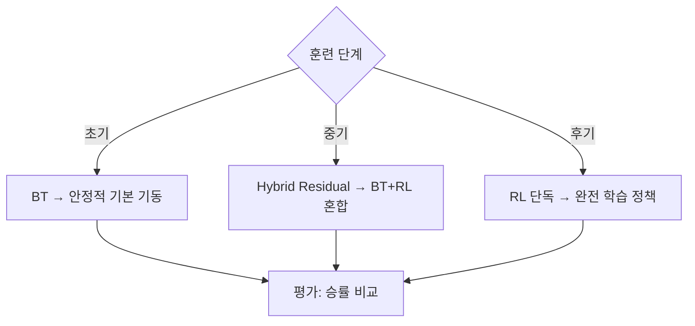

# 🤖 행동 제공자 (Action Provider)

[[00 - 전체 인덱스|← 인덱스로]]

---

## ActionProvider 추상 클래스

```python
class ActionProvider:
    def compute_action(self, context: ActionContext) -> ActionResult: ...
    def reset(self, context: ActionContext | None = None) -> None: ...
    def close(self) -> None: ...
```

### ActionContext
```python
@dataclass
class ActionContext:
    sim: object             # 자신의 JSBSim 인스턴스
    opponent_sim: object    # 상대의 JSBSim 인스턴스
    ownship_state: np.ndarray  # 자신의 상태 벡터
    target_state: np.ndarray   # 상대의 상태 벡터
    observation: np.ndarray    # 현재 관측 벡터
    info: dict              # 추가 정보 (timestep 등)
```

### ActionResult
```python
@dataclass
class ActionResult:
    action: np.ndarray     # [aileron, elevator, rudder, throttle]
    source: str            # "bt" | "rl" | "hybrid"
    confidence: float      # 신뢰도
    info: dict             # 소스별 추가 정보
```

---

## 3가지 제공자 비교

### 1. BTActionProvider
```python
provider = BTActionProvider(dll_name="AIP_DCS_ownship.dll")
# C++ DLL 기반 BehaviorTree
# 결정론적, 빠른 추론
# 전문가 지식 인코딩
```

### 2. RLActionProvider
```python
provider = RLActionProvider(
    bundle_dir="./checkpoints/sac_bundle",
    algorithm_factory=build_algorithm_from_bundle,
    policy_id="default_policy",
    explore=False,
)
# RLlib SAC/PPO 신경망 추론
# 학습된 정책 → 연속 개선 가능
# LSTM 지원 (recurrent state 관리)
```

### 3. HybridActionProvider
```python
provider = HybridActionProvider(
    primary_provider=rl_provider,    # RL이 주도
    secondary_provider=bt_provider,  # BT가 기반
    mode="residual",                 # blend / residual / switch
    alpha=0.5,
    residual_scale=0.35,
)
```

---

## Hybrid 모드 3가지

| 모드 | 계산식 | 용도 |
|------|--------|------|
| `residual` | `BT_action + 0.35 × RL_action` | BT 기동 위에 RL 잔차 추가 (권장) |
| `blend` | `0.5 × RL + 0.5 × BT` | 두 제공자 가중 평균 |
| `switch` | selector 함수가 선택 | 상황에 따라 BT/RL 전환 |

```python
# Residual 모드: BT가 전술적 판단, RL이 미세 조정
action = bt_action + residual_scale * rl_action
```

---

## 제공자 선택 전략



---

## 양측 제공자 설정 예시

```python
# run_local_dogfight.py 참고
ownship_provider = HybridActionProvider(rl, bt)  # 아군: Hybrid
target_provider  = BTActionProvider(...)          # 적기: BT 기준

env = DogFightWrapper(
    ownship_action_provider=ownship_provider,
    target_action_provider=target_provider,
)
```

## 관련 노트

- [[05 - 행동 공간]] — 행동 벡터 정의
- [[10 - 비헤이비어 트리]] — BT 내부 구현
- [[12 - 강화학습 훈련]] — RL 훈련 및 번들 로드
