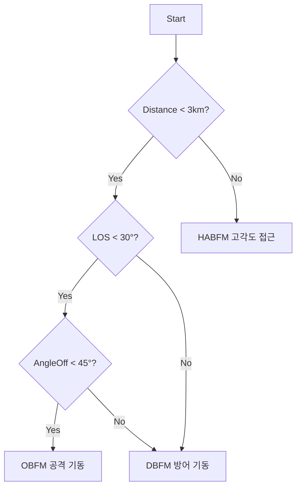

# 🌳 비헤이비어 트리 (BehaviorTree)

[[00 - 전체 인덱스|← 인덱스로]]

---

## 개요

AIP_DCS는 **C++ BehaviorTree.CPP v3** 라이브러리 기반의 전술 AI입니다.
Windows DLL(`AIP_DCS_ownship.dll`, `AIP_BASE_target.dll`)로 빌드되어 Python에서 ctypes로 호출됩니다.

---

## BT 노드 구조

```
BehaviorTree (Root)
├── Service (매 tick마다 상태 업데이트)
│   ├── SelectTarget       — 타겟 선택 (1v1: 자동)
│   ├── DistanceUpdate     — 거리 계산
│   ├── DirectionVectorUpdate — 방향 벡터 계산 (FWD/UP/RIGHT)
│   ├── AngleOffUpdate     — AngleOff 계산
│   ├── AspectAngleUpdate  — Aspect Angle 계산
│   └── CheckSight         — 시선(LOS) 확인
│
├── Decorator (조건 분기)
│   ├── DECO_DistanceCheck — 거리 범위 체크
│   ├── DECO_AngleOffCheck — AngleOff 임계값 체크
│   ├── DECO_LOSCheck      — LOS 각도 체크
│   └── DECO_BFMCheck      — 현재 BFM 모드 체크
│
└── Task (실제 기동 실행)
    └── Task_Empty         — 기본 빈 기동 (VP 전진 설정)
```

---

## BlackBoard (CPPBlackBoard)

모든 노드가 공유하는 전술 데이터 저장소:

```cpp
struct CPPBlackBoard {
    // 위치/자세
    Vector3 MyLocation_Cartesian;      // 아군 위치
    Vector3 TargetLocaion_Cartesian;   // 타겟 위치
    Vector3 VP_Cartesian;              // 가상 포인트 (비행 목표)

    // 방향 벡터
    Vector3 MyForwardVector;
    Vector3 MyUpVector;
    Vector3 MyRightVector;
    Vector3 TargetForwardVector;

    // 각도
    float Distance;             // 타겟까지 거리
    float Los_Degree;           // LOS 각도
    float MyAngleOff_Degree;    // AngleOff

    // 기동 모드
    BFM_Mode BFM;   // OBFM / DBFM / HABFM / EF
    ACM_Mode ACM;   // EF 등
};
```

---

## Service 노드들

| 노드 | 역할 | 입력 | 출력 |
|------|------|------|------|
| `SelectTarget` | 교전 타겟 지정 | Enemy 목록 | BB→TargetLocation |
| `DistanceUpdate` | 거리 계산 | MyLoc, TargetLoc | BB→Distance |
| `DirectionVectorUpdate` | FWD/UP/RIGHT 벡터 갱신 | EulerAngle | BB→FWdVector |
| `AngleOffUpdate` | AngleOff = FWD·TFWD 사이각 | FwdVec, TargetFwdVec | BB→AngleOff |
| `AspectAngleUpdate` | Aspect Angle 계산 | 위치, TargetFwd | BB→AspectAngle |
| `CheckSight` | 적기가 시야에 있는지 | Pitch/Yaw 방향 | BB→Sight |

---

## Decorator 노드들

```cpp
// DECO_DistanceCheck: 거리 임계값 비교
if (UpDown == "Greater") return (distance >= InputDist) ? SUCCESS : FAILURE;

// DECO_AngleOffCheck: AngleOff 임계값 비교
if (UpDown == "Greater") return (angleOff >= InputAO) ? SUCCESS : FAILURE;

// DECO_LOSCheck: LOS 각도 임계값
if (UpDown == "Less") return (los < InputLOS) ? SUCCESS : FAILURE;

// DECO_BFMCheck: 현재 BFM 모드 확인
return (BB->BFM == InputBFM) ? SUCCESS : FAILURE;
```

---

## BFM 모드 전환 로직



---

## Rule.xml 수정 포인트

학생들이 수정 가능한 전술 규칙:
```xml
<BehaviorTree ID="MainTree">
  <Sequence>
    <Service ID="SelectTarget" BB="{BB}"/>
    <Service ID="DistanceUpdate" BB="{BB}"/>
    <!-- Decorator로 조건 분기 추가 가능 -->
    <Decorator ID="DECO_DistanceCheck" BB="{BB}" UpDown="Less" Distance="3000">
      <Task ID="Task_Empty" BB="{BB}"/>
    </Decorator>
  </Sequence>
</BehaviorTree>
```

## 관련 노트

- [[09 - 행동 제공자]] — BT를 ActionProvider로 래핑
- [[11 - 기하학 계산]] — BT가 사용하는 각도 개념
- [[05 - 행동 공간]] — BFM 기동 모드
